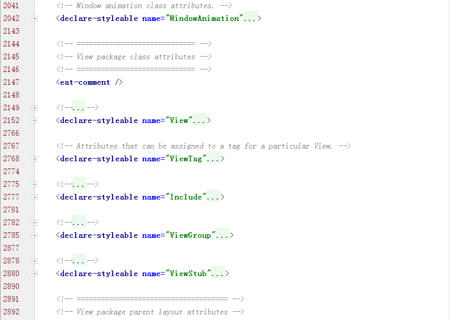

# android attrs.xml  
android attrs.xml 可以在SDK目录下找到：SDK\platforms\android-23\data\res\values\attrs.xml  
  

标签`<eat-comment>`没弄明白什么意思。下面是stackoverflow上找到的解释。

> `<eat-comment/>` is used to suppress comment lines from the documentation output.  


# 自定义attrs
1. 创建attrs.xml  
在value文件夹下新建attrs.xml
- 创建一个 declare-styleable元素  
```xml
<?xml version="1.0" encoding="utf-8"?>
<resources>
    <declare-styleable name="CircleView">
        <attr name="radius" format="float"/>
        <attr name="circleColor" format="color|reference"/>
    </declare-styleable>
</resources>
```
- attr标签属性  
attr 的format属性用于定义值的类型。值的类型有：boolean,integer,float,string不需要解释；
reference:资源ID，color:颜色值，dimension:尺寸值，fraction:百分数，enum:枚举值，
flag:位或运算。  
format可以指定值为多种类型，比如circleColor可以是color，也可以是reference。


# 在自定义View中使用
- 在布局文件中使用自定义attrs
```xml
<com.demo.CircleView
        android:layout_width="match_parent"
        android:layout_height="match_parent"
        app:circleColor="#ff0000"
        app:radius="15"/>
```
- 自定义View  
自定义View的功能很简单，获取xml文件中设置的circleColor和radius,画个圆：  

```java  
public class CircleView extends View
{
    private float mRadius;
    private int mColor;

    public CircleView(Context context)
    {
        this(context, null);
    }

    public CircleView(Context context, AttributeSet attrs)
    {
        super(context, attrs);
        TypedArray typedArray = context.obtainStyledAttributes(attrs, R.styleable.CircleView);
        for (int i = 0; i < typedArray.getIndexCount(); i++)
        {
            int attr = typedArray.getIndex(i);
            switch (attr)
            {
                case R.styleable.CircleView_circleColor:
                    mColor = typedArray.getColor(attr, 0xffbbbbbb);
                    break;
                case R.styleable.CircleView_radius:
                    mRadius = typedArray.getFloat(attr, 10);
                    break;
            }
        }
        //使用完TypedArray,一定要调用recycler()
        typedArray.recycle();
    }

    @Override
    protected void onDraw(Canvas canvas)
    {
        super.onDraw(canvas);

        //初始化paint
        Paint paint = new Paint();
        paint.setColor(mColor);

        int width = getMeasuredWidth();
        int height = getMeasuredHeight();

        //画圆
        canvas.drawCircle(width / 2, height / 2, mRadius, paint);
    }


    @Override
    protected void onMeasure(int widthMeasureSpec, int heightMeasureSpec)
    {
        super.onMeasure(widthMeasureSpec, heightMeasureSpec);

        int measuredHeight = measureDimension(heightMeasureSpec);
        int measuredWidth = measureDimension(widthMeasureSpec);

        setMeasuredDimension(measuredWidth, measuredHeight);
    }

    private int measureDimension(int measureSpec)
    {
        int result = 100;

        int specMode = MeasureSpec.getMode(measureSpec);
        int specSize = MeasureSpec.getSize(measureSpec);

        if (specMode == MeasureSpec.EXACTLY)
        {
            result = specSize;
        } else if (specMode == MeasureSpec.AT_MOST)
        {
            result = Math.min(result, specSize);
        }

        return result;
    }

}

```
# 使用到自定义attr的其他情况

```
public CoordinatorLayout.Behavior (Context context, AttributeSet attrs)
```

在CoordinatorLayout.Behavior的构造函数中，有AttributeSet类型的参数，在自定义Behavior的时候，可以使用自定义的attr，具体使用可以参考下面的链接。

# 自定义View注意事项  

> 主要是要处理wrap_content 和padding。否则xml 那边设置这2个属性就根本没用了。还有不要在view中使用handler 因为人家已经提供了post方法。如果是继承自viewGroup,那在onMeasure和onLayout里面 也要考虑
padding和layout的影响。也就是说specSize 要算一下 。最后就是如果view的动画或者线程需要停止，可以考虑在onDetachedFromWindow里面来做。   

别人家的代码  
```java
public class CircleView extends View {

    private int mColor = Color.RED;
    private Paint mPaint = new Paint(Paint.ANTI_ALIAS_FLAG);

    private void init() {
        mPaint.setColor(mColor);
    }

    @Override
    protected void onMeasure(int widthMeasureSpec, int heightMeasureSpec) {
        super.onMeasure(widthMeasureSpec, heightMeasureSpec);
        int widthSpecMode = MeasureSpec.getMode(widthMeasureSpec);
        int widthSpecSize = MeasureSpec.getSize(widthMeasureSpec);
        int heightSpecMode = MeasureSpec.getMode(heightMeasureSpec);
        int heightSpecSize = MeasureSpec.getSize(heightMeasureSpec);

        //处理为wrap_content时的情况
        if (widthSpecMode == MeasureSpec.AT_MOST && heightSpecMode == MeasureSpec.AT_MOST) {
            setMeasuredDimension(200, 200);
        } else if (widthSpecMode == MeasureSpec.AT_MOST) {
            setMeasuredDimension(200, heightSpecSize);
        } else if (heightSpecMode == MeasureSpec.AT_MOST) {
            setMeasuredDimension(widthSpecSize, 200);
        }

    }

    @Override
    protected void onDraw(Canvas canvas) {
        super.onDraw(canvas);
        //处理padding的情况
        final int paddingLeft = getPaddingLeft();
        final int paddingRight = getPaddingRight();
        final int paddingTop = getPaddingTop();
        final int paddingBottom = getPaddingBottom();


        int width = getWidth() - paddingLeft - paddingRight;
        int height = getHeight() - paddingTop - paddingBottom;
        int radius = Math.min(width, height) / 2;
        canvas.drawCircle(paddingLeft + width / 2, paddingTop + height / 2, radius, mPaint);
    }

    public CircleView(Context context, AttributeSet attrs, int defStyleAttr) {
        super(context, attrs, defStyleAttr);
        init();
    }

    public CircleView(Context context) {
        super(context);
        init();

    }

    public CircleView(Context context, AttributeSet attrs) {
        super(context, attrs);
        init();
    }
}
```

参考链接：  
[ Android中attrs.xml文件的使用详解](http://blog.csdn.net/jiangwei0910410003/article/details/17006087)  
[Android开发学习之TypedArray类](http://blog.csdn.net/richerg85/article/details/11749421)  
[TypedArray Reference](http://developer.android.com/reference/android/content/res/TypedArray.html)  
[关于CoordinatorLayout与Behavior的一点分析](http://www.jianshu.com/p/a506ee4afecb)  
[Style在Android中的继承关系](http://www.tuicool.com/articles/bq2eUvV)  
[2.2　值文件](http://book.2cto.com/201301/14161.html)  
[android XML tag called eat-comment, what is its use?](http://stackoverflow.com/questions/21837986/android-xml-tag-called-eat-comment-what-is-its-use/21893035#21893035)  
[Android View绘制13问13答](http://www.cnblogs.com/punkisnotdead/p/5181821.html)
