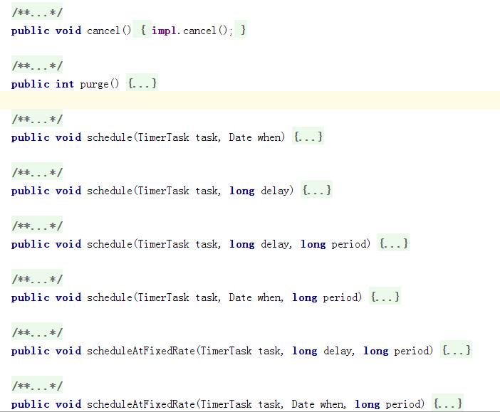
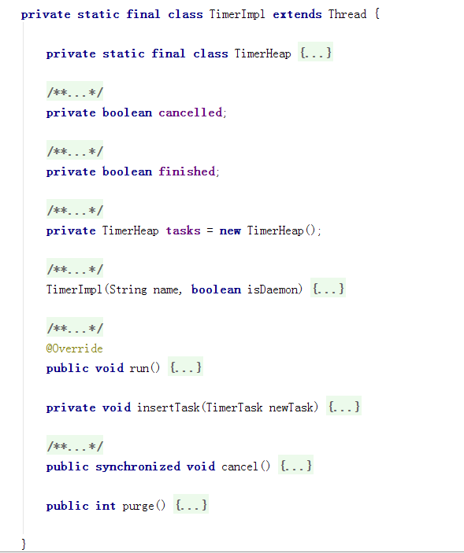
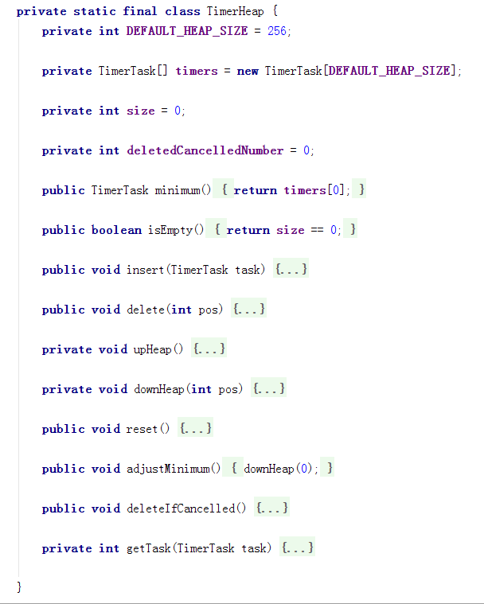

# Timer and TimerTask 源码分析
用到了定时器，看了一下源码，记录一下。  

## Timer 的 结构
Timer 的成员变量以及构造方法：  

<br>首先，是两个静态内部类，TimerImpl 继承于 Thread 类，实现了 Timer 的主要功能；FinalizerHelper 则 实现了 finalize() 方法，用于终止 TimerImpl 。

```java
@Override protected void finalize() throws Throwable {
    try {
        synchronized (impl) {
            impl.finished = true;
            impl.notify();
        }
    } finally {
        super.finalize();
    }
}
```

然后，是一个静态成员变量，和一个静态方法。<br>接着，就是两个 final 类型的成员变量和类的构造函数。<br>下面是 Timer 提供的 8 个 public 方法：  

  

schedule 以及 scheduleAtFixedRate 的重载都是通过下面的方法实现的。  

```java
private void scheduleImpl(TimerTask task, long delay, long period, boolean fixed)
```

Timer 的结构并不复杂。

## Timer 的实现原理
### scheduleImpl 方法
逻辑并不复杂，首先是一个同步块，然后就是判断，初始化 TimerTask ,最后将 TimerTask 插入到 TimerImpl 维护的 TimerHeap 中。

```java
/*
 * Schedule a task.
 */
private void scheduleImpl(TimerTask task, long delay, long period, boolean fixed) {
    synchronized (impl) {
        if (impl.cancelled) {
            throw new IllegalStateException("Timer was canceled");
        }

        long when = delay + System.currentTimeMillis();

        if (when < 0) {
            throw new IllegalArgumentException("Illegal delay to start the TimerTask: " + when);
        }

        synchronized (task.lock) {
            if (task.isScheduled()) {
                throw new IllegalStateException("TimerTask is scheduled already");
            }

            if (task.cancelled) {
                throw new IllegalStateException("TimerTask is canceled");
            }

            task.when = when;
            task.period = period;
            task.fixedRate = fixed;
        }

        // insert the newTask into queue
        impl.insertTask(task);
    }
}
```

### TimerImpl
<br>一个静态内部类 TimerHeap 用于维护 TimerTask 队列。<br>然后是两个标志，TimerHeap 对象，和构造方法。<br>接着，就是 Timer 实现的核心内容了， run() 方法，以及刚才用到的 insertTask() 方法。  

#### 先从简单的看起吧。

```java
private void insertTask(TimerTask newTask) {
  // callers are synchronized
  tasks.insert(newTask);
  this.notify()
}
```

刚才用到的 insertTask() 方法，把工作又交给了 TimerHeap 对象。

#### TimerHeap
<br>TimerHeap 用于维护 TimerTask 队列，实现了增、删、排序、清空等功能。<br>接着刚才的 insert 往下看。<br>TimerHeap 内部有一个 TimerTask 的数组，和 ArrayList 维护数组的方式类似。先判断数组是不是够用，不够用拷贝到一个新数组，新数组大小为之前数组的两倍，然后，将引用指向新数组。再将 task 插入数组最后。在执行 upHeap() 。

```java
public void insert(TimerTask task) {
    if (timers.length == size) {
        TimerTask[] appendedTimers = new TimerTask[size * 2];
        System.arraycopy(timers, 0, appendedTimers, 0, size);
        timers = appendedTimers;
    }
    timers[size++] = task;
    upHeap();
}
private void upHeap() {
    int current = size - 1;
    int parent = (current - 1) / 2;

    while (timers[current].when < timers[parent].when) {
        // swap the two
        TimerTask tmp = timers[current];
        timers[current] = timers[parent];
        timers[parent] = tmp;

        // update pos and current
        current = parent;
        parent = (current - 1) / 2;
    }
}
private void downHeap(int pos) {
    int current = pos;
    int child = 2 * current + 1;

    while (child < size && size > 0) {
        // compare the children if they exist
        if (child + 1 < size
                && timers[child + 1].when < timers[child].when) {
            child++;
        }

        // compare selected child with parent
        if (timers[current].when < timers[child].when) {
            break;
        }

        // swap the two
        TimerTask tmp = timers[current];
        timers[current] = timers[child];
        timers[child] = tmp;

        // update pos and current
        current = child;
        child = 2 * current + 1;
    }
}
```

upHeap() 排序方式不是严格的按每个 task.when 的大小排序，不过，仍然是时间紧迫的往前提。upHeap() 和 downHeap() 是两个比较有意思的算法，都是实现时间紧的往前提。<br>剩下的几个方法： adjustMinimum() 没找到用的地方，deleteIfCancelled() 将取消的任务踢出队列，getTask(TimerTask task) 获取 task 对象所在位置。

#### run() 方法
TimerImpl 在构造方法中直接启动线程。在代码中加注释吧，写起来太费劲了。

```java
public void run() {
    while (true) {
        TimerTask task;
        synchronized (this) {
            // cancel会在这起作用
            if (cancelled) {
                return;
            }
            if (tasks.isEmpty()) {
                //数组任务队列执行完成后结束
                if (finished) {
                    return;
                }
                // 没任务的时候等待，insert cancel 以及 finalize 都会 notify
                try {
                    this.wait();
                } catch (InterruptedException ignored) {
                }
                continue;
            }

            long currentTime = System.currentTimeMillis();

            task = tasks.minimum();
            long timeToSleep;

            //task 取消后，踢出队列，计算等待时间
            synchronized (task.lock) {
                if (task.cancelled) {
                    tasks.delete(0);
                    continue;
                }

                // check the time to sleep for the first task scheduled
                timeToSleep = task.when - currentTime;
            }

            //没到执行时间就等待
            if (timeToSleep > 0) {
                // sleep!
                try {
                    this.wait(timeToSleep);
                } catch (InterruptedException ignored) {
                }
                continue;
            }

            // 等待结束，或者被其他事件唤醒，接着执行

            // 锁定 task
            synchronized (task.lock) {
                //判断最紧迫的是否为当前 task
                int pos = 0;
                if (tasks.minimum().when != task.when) {
                    pos = tasks.getTask(task);
                }

                // task 取消后，踢出队列
                if (task.cancelled) {
                    tasks.delete(tasks.getTask(task));
                    continue;
                }

                // set time to schedule
                task.setScheduledTime(task.when);

                // remove task from queue
                tasks.delete(pos);

                // fixed rate 的区别，一个是周期确定的，一个是受执行时间影响的
                // set when the next task should be launched
                if (task.period >= 0) {
                    // this is a repeating task,
                    if (task.fixedRate) {
                        // task is scheduled at fixed rate
                        task.when = task.when + task.period;
                    } else {
                        // task is scheduled at fixed delay
                        task.when = System.currentTimeMillis()
                                + task.period;
                    }

                    // insert this task into queue
                    insertTask(task);
                } else {
                    task.when = 0;
                }
            }
        }

        // 所有的 task 会在一个线程中运行，task 中不能执行耗时的任务，否则，即使是
        // fixedRate 也不会按时执行。
        boolean taskCompletedNormally = false;
        try {
            task.run();
            taskCompletedNormally = true;
        } finally {
            if (!taskCompletedNormally) {
                synchronized (this) {
                    cancelled = true;
                }
            }
        }
    }
}
```

上面是在 Android Studio 中找到的源码，和 Eclipse 中的源码并不相同，不过实现思路一样。
