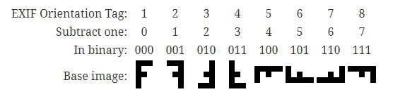
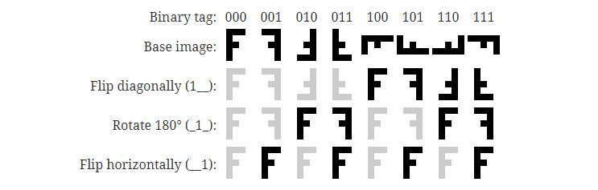

# 图片方向

## 图片方向与纠正算法

图片的方向：



图片方向纠正算法：



每一位代表不同的操作，8 个方向，可以通过 3 种基本操作的组合实现转换：

- 001 : 水平翻转
- 010 ：旋转 180 度
- 100 ：顺时针旋转 90 度，水平翻转

## 代码

生成纠正矩阵：

```kotlin
// 获取 orientation tag
val exifInterface = ExifInterface(srcPath)
val tag = exifInterface.getAttributeInt(ExifInterface.TAG_ORIENTATION, ExifInterface.ORIENTATION_NORMAL)
// 转换为 binary
val orientation = tag - 1
val matrix = Matrix()
if (orientation and 0x04 != 0) {
    // 水平翻转
    matrix.postScale(-1.0f, 1.0f)
    // 顺时针旋转 90 度
    matrix.postRotate(-90f)
}
if (orientation and 0x02 != 0) {
    // 旋转 180 度
    matrix.postRotate(180f)
}
if (orientation and 0x01 != 0) {
    // 水平翻转
    matrix.postScale(-1.0f, 1.0f)
}
```

## 参考连接

- [Exif图片方向的一些发现](https://juejin.im/post/5bc3fbcc5188255c672ed754)
