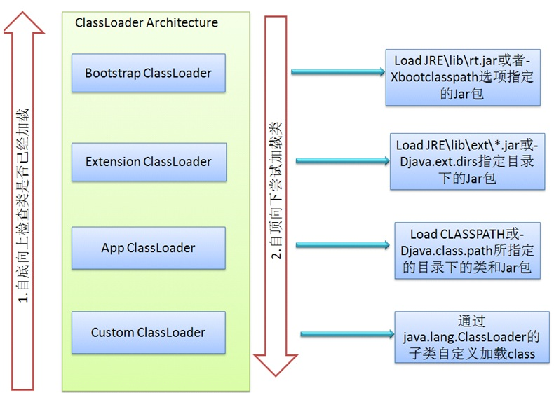

# ClassLoader

## java 默认提供的三种 ClassLoader
### BootStrap ClassLoader

启动类加载器，是Java类加载层次中最顶层的类加载器，负责加载JDK中的核心类库，如：rt.jar、resources.jar、charsets.jar等。

### Extension ClassLoader

扩展类加载器，负责加载Java的扩展类库，默认加载JAVA_HOME/jre/lib/ext/目下的所有jar。

### App ClassLoader

系统类加载器，负责加载应用程序classpath目录下的所有jar和class文件。

## Customer ClassLoader

Java中提供的默认ClassLoader，只加载指定目录下的jar和class，如果我们想加载其它位置的类或jar时，比如：加载网络上的 class 文件。

定义自已的类加载器分为两步：
1. 继承java.lang.ClassLoader
2. 重写父类的findClass方法

**如没有特殊的要求，一般不建议重写loadClass搜索类的算法**

## ClassLoader 加载顺序

ClassLoader 采用的是`双亲委托模型`来搜索类的。

**why**

- 这样可以避免重复加载，当父亲已经加载了该类的时候，就没有必要子ClassLoader再加载一次。
- 防止自定义的类替代 Java 核心 api 中的类。

1. 自底向上检查类是否已经加载
2. 自顶向下尝试加载类

## 参考链接
- [ 深入分析Java ClassLoader原理](http://blog.csdn.net/xyang81/article/details/7292380)
