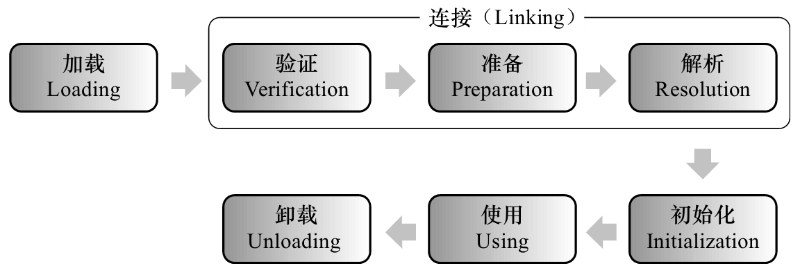

# 类的加载

## 类的生命周期

图片来源于《深入理解Java虚拟机》

- 加载、验证、准备、初始化和卸载这5个阶段的顺序是确定的
- 而解析阶段则不一定

类加载的时机，java 虚拟机规范没有强制约束。

## java 类初始化的 5 种情况

虚拟机规范严格规定了有且只有 5 种情况必须立即对类进行初始化。

1. 遇到 new、getstatic、putstatic 或 invokestatic 这 4 条字节码指令时，如果类没有进行过初始化，则需要先触发其初始化。
2. 使用 java.lang.reflect 包的方法对类进行反射调用的时候，如果类没有进行过初始化，则需要先触发其初始化。
3. 当初始化一个类的时候，如果发现其父类还没有进行过初始化，则需要先触发其父类的初始化。
4. 当虚拟机启动时，用户需要指定一个要执行的主类（包含 main() 方法的那个类），虚拟机会先初始化这个主类。
5. 当使用 JDK 1.7 的动态语言支持时，如果一个 java.lang.invoke.MethodHandle 实例最后的解析结果 REF_get-Static、REF_putStatic、REF_invokeStatic 的方法句柄，并且这个方法句柄所对应的类没有进行过初始化，则需要先触发其初始化。

## 关于类的初始化

- 对于静态字段，只有直接定义这个字段的类才会被初始化，因此通过其子类来引用父类中定义的静态字段，只会触发父类的初始化而不会触发子类的初始化。
- 在编译阶段会对常量进行优化，将常量加入到运行类的常量池中，对常量的引用不会触发初始化。
  ```java
  public class SubClass extends SupperClass{
      static {
          System.out.println("SubClass init");
      }
  }
  public class SupperClass {
      public static int number = 1;
      public static final int COUNT = 0;

      static {
          System.out.println("SupperClass init");
      }
  }
  public class Main {
      public static void main(String[] args) {
          System.out.println(SubClass.COUNT);
          System.out.println("count has print");
          System.out.println(SubClass.number);
      }
  }
  ```

  运行结果
  ```
  0
  count has print
  SupperClass init
  1
  ```

- 新建数组，不会触发类的初始化，会触发由虚拟机自动生成的数组类的初始化。
