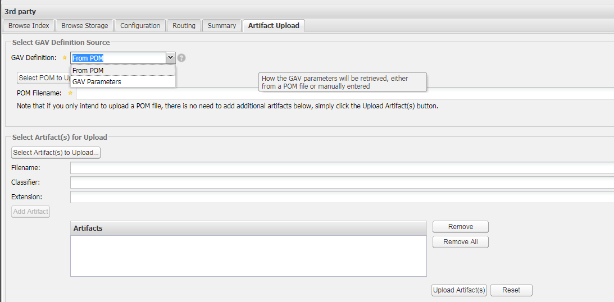

# maven 基础

## 命令行运行
### 编译
exec:java 不会自动编译代码，需要手动编译
```
mvn compile
```

### 执行

- 指定 mainClass
```
mvn exec:java -Dexec.mainClass="com.vineetmanohar.module.Main"
```

- 传递参数
```
mvn exec:java -Dexec.mainClass="com.vineetmanohar.module.Main" -Dexec.args="arg0 arg1 arg2"
```

- 指定 classpath

```
mvn exec:java -Dexec.mainClass="com.vineetmanohar.module.Main" -Dexec.classpathScope=runtime
```

## maven Resources
maven 默认 resources 文件夹下的内容会编译到 classpath 下。但是，在 pom.xml 中配置 resources 节点后，resources 就不会自动编译到 classpath 下。

## maven 镜像配置

在 mavenHome/conf 文件夹下有个 settings.xml 通过 mirrors 节点配置镜像，可以配置多个。

```xml
<mirrors>
  <mirror>
    <id>alimaven</id>
    <name>aliyun maven</name>
    <url>http://maven.aliyun.com/nexus/content/groups/public/</url>
    <mirrorOf>central</mirrorOf>
  </mirror>
  <mirror>
    <id>nexus</id>
    <mirrorOf>*</mirrorOf>
    <name>Local Repository</name>
    <url>http://192.168.1.6:8081/nexus/content/groups/public</url>
  </mirror>
  <mirror>
    <id>nexus</id>
    <mirrorOf>*</mirrorOf>
    <name>Local Repository</name>
    <url>http://106.14.186.157:10081/nexus/content/groups/public</url>
  </mirror>
</mirrors>
```

## 私服 nexus 上传 jar 包

- 登录 nexus
- 选中 3rd party 通过 Artifact Upload 选项上传 jar 包


- GAV Defination 有两种形式 From POM 与 GAV Parmeters 。

  如果 jar 包不依赖其他 jar 包，可以选择 GAV Parmeters 。
  如果 jar 包依赖其他 jar 包，只能选择 From POM ，否则 maven 不能自动解决依赖。

## 参考链接
- [使用Maven运行Java main的3种方式](http://www.tuicool.com/articles/UJJvim)
