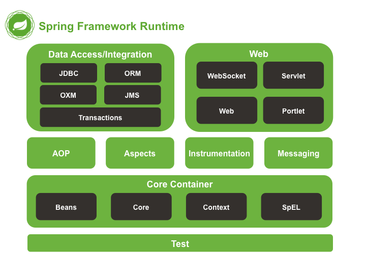

# spring framework

**Overview of the Spring Framework**

GroupId	| ArtifactId	| Description
---|---|---
org.springframework | spring-aop | Proxy-based AOP support
org.springframework | spring-aspects | AspectJ based aspects
org.springframework | spring-beans | Beans support, including Groovy
org.springframework | spring-context | Application context runtime, including scheduling and remoting abstractions
org.springframework | spring-context-support | Support classes for integrating common third-party libraries into a Spring application context
org.springframework | spring-core | Core utilities, used by many other Spring modules
org.springframework | spring-expression | Spring Expression Language (SpEL)
org.springframework | spring-instrument | Instrumentation agent for JVM bootstrapping
org.springframework | spring-instrument-tomcat | Instrumentation agent for Tomcat
org.springframework | spring-jdbc | JDBC support package, including DataSource setup and JDBC access support
org.springframework | spring-jms | JMS support package, including helper classes to send and receive JMS messages
org.springframework | spring-messaging | Support for messaging architectures and protocols
org.springframework | spring-orm | Object/Relational Mapping, including JPA and Hibernate support
org.springframework | spring-oxm | Object/XML Mapping
org.springframework | spring-test | Support for unit testing and integration testing Spring components
org.springframework | spring-tx | Transaction infrastructure, including DAO support and JCA integration
org.springframework | spring-web | Web support packages, including client and web remoting
org.springframework | spring-webmvc | REST Web Services and model-view-controller implementation for web applications
org.springframework | spring-webmvc-portlet | MVC implementation to be used in a Portlet environment
org.springframework | spring-websocket | WebSocket and SockJS implementations, including STOMP support

spring 最主要的特点有两个： **IOC** 和 **AOP** 。

## 创建对象的三种方式

- 手动创建 new
- 工厂模式 get
- 注入 set

## IOC
IOC (Inversion of Control) 控制反转：

>本来是由应用程序管理的对象之间的依赖关系，现在交给了容器管理，这就叫控制反转，即交给了IOC容器，Spring的IOC容器主要使用DI方式实现的。不需要主动查找，对象的查找、定位和创建全部由容器管理。

依赖注入的两种方式：

- 构造方法注入
- setter 注入

IOC 容器：
- BeanFactory 容器
- ApplicationContext 容器

Spring 配置元数据
- 基于 XML 的配置文件。
- 基于注解的配置
- 基于 Java 的配置

### bean
作用域  | 描述
--|--
singleton	| 该作用域将 bean 的定义的限制在每一个 Spring IoC 容器中的一个单一实例(默认)。
prototype	| 该作用域将单一 bean 的定义限制在任意数量的对象实例。
request	| 该作用域将 bean 的定义限制为 HTTP 请求。只在 web-aware Spring ApplicationContext 的上下文中有效。
session	| 该作用域将 bean 的定义限制为 HTTP 会话。 只在web-aware Spring ApplicationContext的上下文中有效。
global-session	| 该作用域将 bean 的定义限制为全局 HTTP 会话。只在 web-aware Spring ApplicationContext 的上下文中有效。

### 注解
注解 | 描述
--|--
@Required | 用于 setter 方法，表示 bean 必须配置，否则容器会抛出 BeanInitializationException  异常。
@Autowired | 可以应用到 bean 属性的 setter 方法，非 setter 方法，构造函数和属性，它会在方法中视图执行 byType 自动连接。
@Qualifier | 当存在多个具有相同类型的 bean 时，通过指定确切的将被连线的 bean，@Autowired 和 @Qualifier 注解可以用来删除混乱。

注解 | 描述
--|--
@Service | 用于标注业务层组件
@Controller | 用于标注控制层组件（如struts中的action）
@Repository | 用于标注数据访问组件，即DAO组件
@Component | 泛指组件，当组件不好归类的时候，我们可以使用这个注解进行标注。

4 个注解功能等效，但是在命名上对功能做了区分。

## AOP
AOP（Aspect Oriented Programming）

### 核心概念
1. 横切关注点

对哪些方法进行拦截，拦截后怎么处理，这些关注点称之为横切关注点

2. 切面（aspect）

类是对物体特征的抽象，切面就是对横切关注点的抽象

3. 连接点（joinpoint）

被拦截到的点，因为Spring只支持方法类型的连接点，所以在Spring中连接点指的就是被拦截到的方法，实际上连接点还可以是字段或者构造器

4. 切入点（pointcut）

对连接点进行拦截的定义

5. 通知（advice）

所谓通知指的就是指拦截到连接点之后要执行的代码，通知分为前置、后置、异常、最终、环绕通知五类

6. 目标对象

代理的目标对象

7. 织入（weave）

将切面应用到目标对象并导致代理对象创建的过程

8. 引入（introduction）

在不修改代码的前提下，引入可以在运行期为类动态地添加一些方法或字段

### spring 对 AOP 的支持

Spring中AOP代理由Spring的IOC容器负责生成、管理，其依赖关系也由IOC容器负责管理。因此，AOP代理可以直接使用容器中的其它bean实例作为目标，这种关系可由IOC容器的依赖注入提供。Spring创建代理的规则为：

- 默认使用Java动态代理来创建AOP代理，这样就可以为任何接口实例创建代理了
- 当需要代理的类不是代理接口的时候，Spring会切换为使用CGLIB代理，也可强制使用CGLIB

AOP编程其实是很简单的事情，纵观AOP编程，程序员只需要参与三个部分：
1. 定义普通业务组件
2. 定义切入点，一个切入点可能横切多个业务组件
3. 定义增强处理，增强处理就是在AOP框架为普通业务组件织入的处理动作

## 参考链接
- [Java回顾之Spring基础](http://www.cnblogs.com/wing011203/archive/2013/05/15/3078849.html)
- [谈谈对Spring IOC的理解](http://blog.csdn.net/qq_22654611/article/details/52606960)
- [Spring-- IOC容器详解](http://www.open-open.com/lib/view/open1338175365089.html)
- [Quick Start](https://projects.spring.io/spring-framework/#quick-start)
- [Spring注解@Component、@Repository、@Service、@Controller区别](http://blog.csdn.net/zhang854429783/article/details/6785574)
- [Spring 教程](http://wiki.jikexueyuan.com/project/spring/)
- [Spring AOP详解](http://www.cnblogs.com/hongwz/p/5764917.html)
- [Spring各个jar包作用](http://blog.csdn.net/c1285214773/article/details/53306853)
- [2. Introduction to the Spring Framework](http://docs.spring.io/spring-framework/docs/current/spring-framework-reference/html/overview.html)
