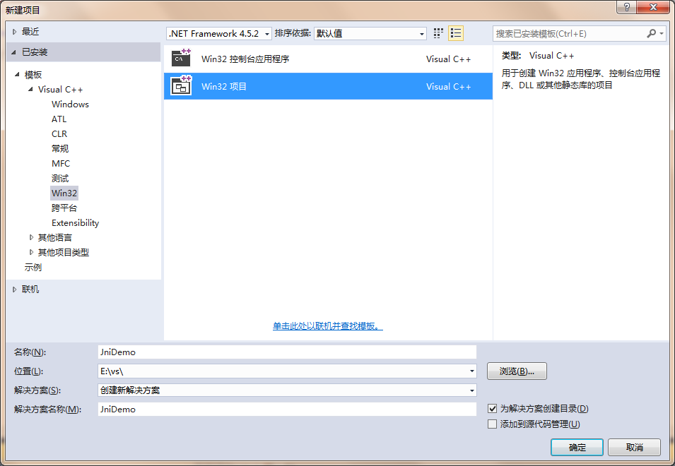
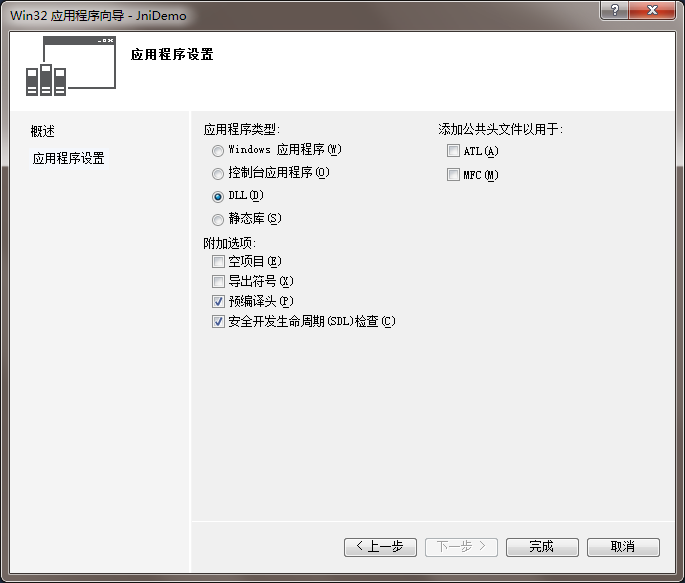
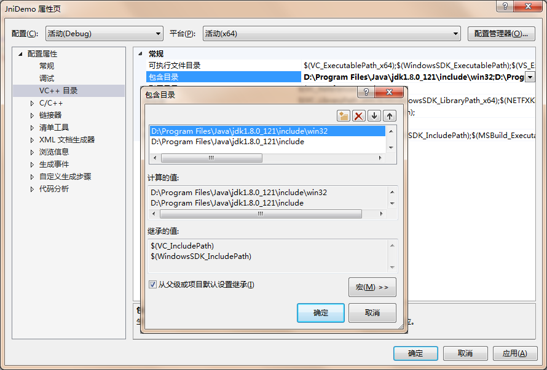
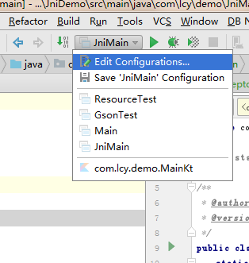
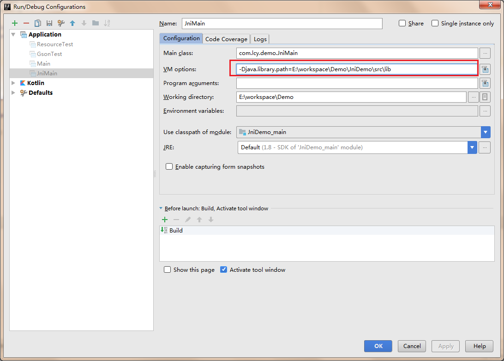

# JNI 入门

## 定义 JNI 方法

```java
public class JniMain {
    public static native void sayHello();

    public static void main(String[] args) {
        sayHello();
    }
}
```

## 生成 JNI 头文件

先编译，生成 class 文件，切换到 class 文件根目录下，使用 javah 生成头文件。

```
javah com.lcy.demo.JniMain
```

## 生成 dll

- 新建 win32 dll 项目

  

  

- 加入需要的头文件路径

  

- 编写 jni 代码

  就输出个 Hello Jni 就好了。

  ```cpp
  #include "stdafx.h"
  #include "com_lcy_demo_JniMain.h"
  #include <stdio.h>

  JNIEXPORT void JNICALL Java_com_lcy_demo_JniMain_sayHello
  (JNIEnv *, jclass){
  	printf("Hello Jni");
  }
  ```

- 编译生成 dll

## 加载 dll 运行

注意事项：

**Java 虚拟机是有 64 位与 32 位区别的，在 Windows/Linux 上64 位的虚拟机不支持 32 位的 jni library**

### 加载 dll 的两种方式：

- System.load

  使用绝对路径加载 dll 文件或者 so 文件。

  ```java
  System.load("E:\\workspace\\Demo\\JniDemo\\src\\lib\\JniDemo_x64.dll");
  ```

- System.loadLibrary

  使用相对路径加载，不需要指明文件的扩展名，要依赖于 System.property : `java.library.path`。

  ```java
  System.loadLibrary("JniDemo_x64"));
  ```

### IDEA 中设置 java.library.path

- 编辑运行配置

  

- 设置 vm option

  

### 获取虚拟机位数

可以这么定义 jni library ，32 位的在名称后加 `_32`，64 位的在名称后加 `_64`，加载的时候获取虚拟机位数，拼接。

```java
static {
    String bit = System.getProperty("sun.arch.data.model");
    System.loadLibrary("JniDemo"+"_"+bit);
}
```

## 参考链接
- [System.load 和 System.loadLibrary详解](http://blog.csdn.net/ring0hx/article/details/3242245)
