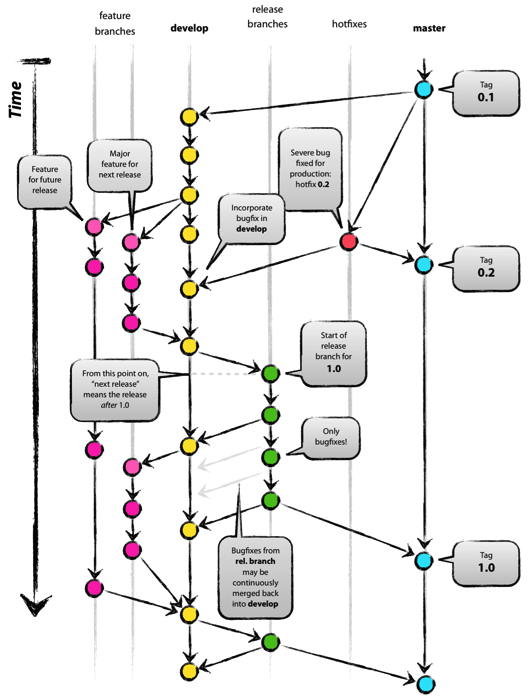

# Git Flow

Git Flow 、Github Flow、Gitlab Flow 是使用 git 分支进行团队协作开发的不同形式。

## Git Flow

> git工作流提倡一个master分支和一个develop分支，同时也包括了feature分支、release分支、hotfixe分支。开发工作在develop分支进行，然后提交到release分支，最后合并到master分支。

**分支过多，管理分支比较繁琐**

> 这个模式是基于"版本发布"的，目标是一段时间以后产出一个新版本。但是，很多网站项目是"持续发布"，代码一有变动，就部署一次。这时，master分支和develop分支的差别不大，没必要维护两个长期分支。

## Github Flow

> Github flow 是Git flow的简化版，专门配合"持续发布"。

流程：

- 从远程 master 拉取 feature 分支
- 在远程仓库建立 feature 分支，将代码提交到 feature 分支
- 开发完成，创建 pull request 请求，让其他开发者进行审查，确认完成后，与 master 分支合并

> - 令master 分支时常保持可以部署的状态
- 合并的代码一定要测试

## Gitlab Flow

> Gitlab flow 是 Git flow 与 Github flow 的综合。它吸取了两者的优点，既有适应不同开发环境的弹性，又有单一主分支的简单和便利。

Gitlab flow 的最大原则叫做"上游优先"（upsteam first），即只存在一个主分支 master，它是所有其他分支的"上游"。只有上游分支采纳的代码变化，才能应用到其他分支。

## 参考链接
- [Git 工作流程](http://www.ruanyifeng.com/blog/2015/12/git-workflow.html)
- [GitLab Flow的使用](https://www.15yan.com/topic/yi-dong-kai-fa-na-dian-shi/6yueHxcgD9Z/)
