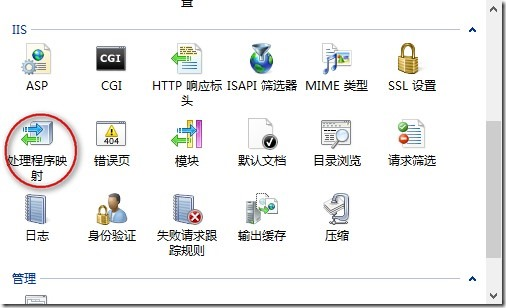
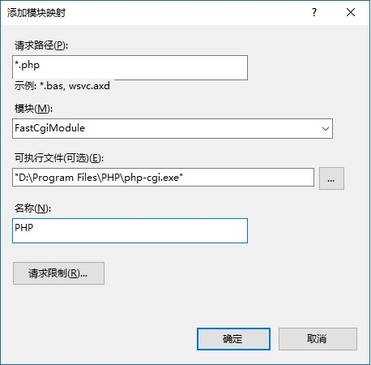
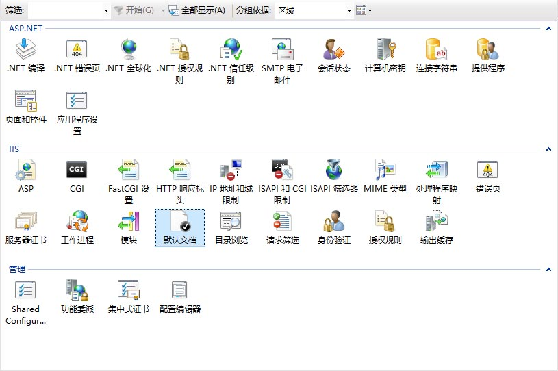
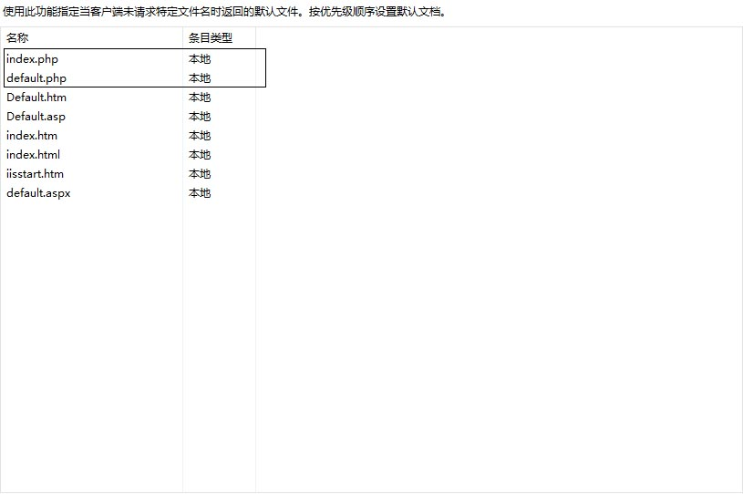

# 配置 PHP 环境

## 安装 PHP

- [下载 windows 版本 PHP](http://windows.php.net/download)<br>
  **注意区分 32 位、64 位**
- 解压
- 配置 php.ini

  - 切换到 PHP 根目录下，复制 php.ini-development ，为 php.ini
  - 启用模块<br>
    将相应模块前的 `;` 去掉。

    ```
    extension=php_gd2.dll
    extension=php_mbstring.dll
    extension=php_mysqli.dll
    extension=php_pdo_mysql.dll
    ```

    启用并配置 extension_dir

    ```
    extension_dir = "D:\Program Files\PHP\ext"
    ```

  - 保存，复制到 `C:\Windows` 目录下

## IIS 中配置 PHP

- 打开处理程序映射<br>
  
- 添加模块映射<br>
  
- 打开添加默认文档<br>
  
- 添加默认文档<br>
  

## 配置 phpcms

- 配置 MySQL<br>
  在 phpcms 项目目录下找到 caches/configs/database.php ， 修改 mysql 的地址。
- 修改 Url<br>
  在 phpcms 项目目录下找到 caches/configs/system.php，将里面的域名全部替换。

- 在 IIS 下新建网站，指向 phpcms 工程目录

- 验证码不显示 找到 phpcms/modules/admin/index.php ，将 33 行 - 36 行代码注释掉

  ```php
  $code = isset($_POST['code']) && trim($_POST['code']) ? trim($_POST['code']) : showmessage(L('input_code'), HTTP_REFERER);
  if ($_SESSION['code'] != strtolower($code)) {
  $_SESSION['code'] = '';
  showmessage(L('code_error'), HTTP_REFERER);
  }
  ```

- 进入 phpcms 后台，批量更新 url<br>
  内容 -> 发布管理 -> 批量更新URL ,点击更新

- 验证码不显示的原因<br>
  php_gd2 插件为开启，编辑 php.ini 保存，重启 IIS。

  ```
  extension=php_gd2.dll
  ```

## 文件上传限制

php.ini 下的两个属性：<br>

- post_max_size
- upload_max_filesize

**一定要保证 post_max_size >= upload_max_filesize**

## 参考链接

- [Windows 8 IIS配置PHP运行环境](http://www.cnblogs.com/haocool/archive/2012/10/14/windows-8-iis-to-configure-php-runtime-environment.html)
