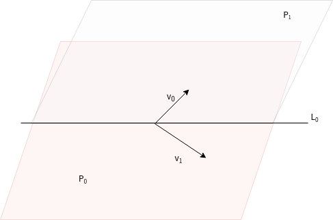
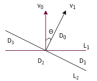

# 基于余弦的LSH ，局部敏感哈希与随机超平面

## LSH 定义

给定一族哈希函数 H ， H 是一个从欧式空间 S 到哈希编码空间 U 的映射 , $H = \{ h: S \rightarrow U \}$。如果对于任意 H 中的函数 h 满足以下两个条件:

- 若 $d(p,q) <d_1$ 则 $P_r[h(q)=h(p)] \geq p_1$
- 若 $d(p,q) >d_2$ 则 $P_r[h(q)=h(p)] \leq p_2$

则称此哈希函数是 $(d_1,d_2,p_1,p_2)$ 敏感的。

**简单的说就是**：

把高维数据降维到低维数据的同时，还能在一定程度上保持相似度不变。LSH 不是确定性的，有一定的概率发生下面的情况：

- 将原本不想似的数据映射成一个哈希值，这种情况称为 false positive
- 将原本相似的数据映射称两个哈希值，这种情况称为 false negative

这在降维的过程中是不可避免的，LSH 可以通过相应的参数控制出现这种错误的概率。

## LSH 的实现算法

对不同的相似度计算方法，有不同的实现算法：

- 使用 Jaccard 相似系数度量相似度时的 min hash
- 使用欧式距离度量数据相似度时的 P-stable hash
- 使用余弦相似度时的随机超平面

## 基于余弦距离的 LSH

### 随机超平面

Charikar M S 于2002 年提出了超平面的思想，通过随机超平面在一定概率下将多个不同方向的向量分开。此方法具有 $(d_1,d_2,(180-d_1)/180,(180-d_2)/180)$ 敏感性。

> 超平面是平面中的直线、空间中的平面之推广（n大于3才被称为“超”平面），是纯粹的数学概念，不是现实的物理概念。

- 高维空间（纬度一般大于 3 ）
- 两个不共线的向量 $v_0、v_1$ 之间的夹角为 $\theta _0$
-  $v_0、v_1$ 可以确定一个超平面 $P_0$
- 对于每一个与 $P_0$ 不共面的超平面 $P_1$ 都会与 $P_0$ 产生一条交线 $L_0$
- $L_0$ 与 $v_0、v_1$ 产生至多两种关系，$v_0、v_1$ 在 $L_0$ 划分的同一侧，或者不同侧

超平面既然是空间平面的推广，这里借助 3 维平面去理解，上面的内容：

Charikar M S 设计了一族哈希函数使得在 $L_0$ 所划分的超平面 $P_0$ 某一侧的向量被哈希成 1 ，另一侧的被哈希成 0。有如下哈希函数：

$h_p(v) = \begin{cases} 1,v \cdot u \geq 0\\ 0,v \cdot u < 0 \end{cases}$

其中 u 是给定随机超平面的法向量，v 是待哈希的向量。
寻找随机超平面时只需要寻找随机超平面的法向量。因为对任意不为零向量的随机向量都存在一个和此向量正交的超平面。

要求：随机向量要依角度均匀分布，保证随机向量在 $P_0$ 超平面的投影 $v_3$ 可以指向任何方向，且对应的概率是相等的。需要对向量的每一个维度上使用高斯分布给定特定的随机值。

当给定一随机产生的 $v_3$，对向量 $v_0、v_1$ 有以下几种情况，$L_0、L_1$分别与 $v_0、v_1$ 正交，$D_0、D_1、D_2、D_3$ 为 $L_0、L_1$ 划分出的区域 ，$v_0、v_1$ 的夹角为 $\theta$。

$v_3$ 落在不同区域，对应的 $v_0、v_1$ 的哈希值如下：

v     | $D_0$ | $D_1$ | $D_2$ | $D_3$
------|:------|:------|:------|:-----
$v_0$ | 1     | 0     | 1     | 0
$v_1$ | 1     | 1     | 0     | 0

由上图可知：$P_r[h(v_0) = h(v_1)] = (180 - \theta )/180$ 。

给定 $\theta _1、\theta _2$，若 $\theta _2 > \theta _1$。

- 当 $v_0、v_1$ 之间的夹角小于 $\theta _1$ 时，$P_r[h(v_0) = h(v_1)] > (180 - \theta _1)/180$
- 当 $v_0、v_1$ 之间的夹角大于 $\theta _2$ 时，$P_r[h(v_0) = h(v_1)] < (180 - \theta _2)/180$

### 实现步骤

对于 d 维的向量集合：

- 随机产生 k 个 d 维的向量
- 使用 LSH 函数，计算每个向量的 hash 值

## LSH 增强

- 一族哈希函数，有 n （$n\geq m\cdot k$）个
- 每个 hash 值，由 k 个函数生成
- 保证每次选的 k 个函数之前没有使用过，重复 m 次，生成 m 个 hash 值

AND 操作：m 个 hash 值完全相同，则认为落到同一个 hash 桶内，这样可以降低不相似的向量落到同一个桶内的概率即降低 false positive rate。

OR 操作：m 个 hash 值有一个值相同，则认为落到同一个 hash 桶内，这样可以降低相似的向量落到不同桶内的概率即降低 false negative rate。

AND OR 级联操作：将上面两种操作组合起来。

### top-k 问题

在取 top-k 的问题上，从 hash 桶中取到数据后，还要进行相似度比对：

- 如果单个 hash 值取到的数据量少，可以考虑使用 OR 操作，增大对比范围，保证召回率
- 如果单个 hash 值取到的数据量足够多，考虑增加 hash 值的数量，减少对比范围，保证检索效率

## 参考

- [基于余弦距离的局部敏感哈希的KNN算法在中文文本上的快速分类
](http://xueshu.baidu.com/usercenter/paper/show?paperid=8757f91fabb6ce8bedd56786496dfb7d&site=xueshu_se)
- [大规模数据的相似度计算：LSH算法](https://zhuanlan.zhihu.com/p/46164294)
- [LSH(Locality Sensitive Hashing)原理与实现](https://blog.csdn.net/guoziqing506/article/details/53019049/)
- [局部敏感哈希(Locality-Sensitive Hashing, LSH)方法介绍](https://blog.csdn.net/icvpr/article/details/12342159)